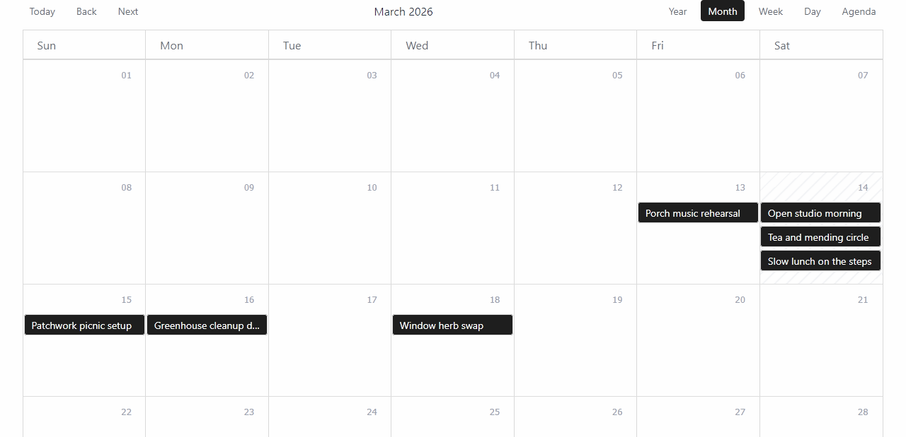
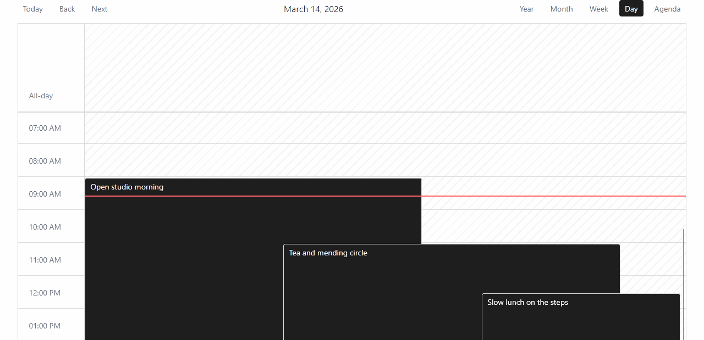
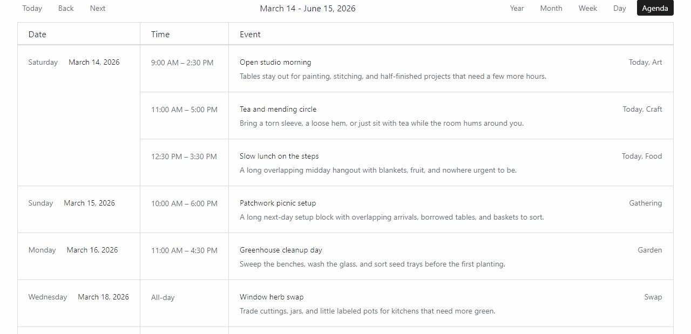

# WordPress Calendar

WordPress Calendar lets you add structured event data to posts and query those events as individual occurrences.

## Event data model

Event data is stored on source posts. A post becomes an event source when it contains one or more event definitions in the `_wp_calendar_events` meta key. A single post can define multiple events and remain queryable.

You can create event data in three ways:

- Use the built-in editor UI enabled in **Settings > WordPress Calendar**
- Use Advanced Custom Fields (ACF), as long as it saves the same `_wp_calendar_events` meta structure
- Use your own PHP code

## Derived meta keys

The plugin maintains these meta keys on source posts:

- `_wp_calendar_events` — the array of event definitions
- `_wp_calendar_has_events` — a derived flag (`1` or missing) used for coarse event-source queries
- `_wp_calendar_events_range_start` — the canonical start date for the entire set of events on this post
- `_wp_calendar_events_range_end` — the canonical end date for the entire set of events on this post (may be missing for open-ended recurring events)

## Occurrence-specific meta keys

When you query event occurrences, the plugin exposes these meta keys for each expanded occurrence. These describe the current occurrence, not the source post:

- `_wp_calendar_event_start` — the occurrence start date
- `_wp_calendar_event_end` — the occurrence end date
- `_wp_calendar_event_label` — the occurrence label (falls back to the source post title if the event row has no label)

The loop post object also exposes: `post_event_id`, `post_event_start`, `post_event_end`, `post_event_label`, `post_event_source_id`, `post_event_source_index`, and `post_event_occurrence_index`.

If a source post contains multiple event definitions, the summary range describes the complete set of events. Each occurrence carries its own start date, end date, and label.

Example `_wp_calendar_events` value:

```php
update_post_meta( $post_id, '_wp_calendar_events', array(
  array(
    'label'           => '',
    'all_day'         => 1,
    'start'           => '2026-03-13 00:00:00',
    'end'             => '2026-03-20 23:59:59',
    'repeat'          => 'none',
    'repeat_interval' => 1,
    'repeat_byday'    => array(),
    'repeat_until'    => '',
  ),
  array(
    'label'           => 'Team Meeting',
    'all_day'         => 0,
    'start'           => '2026-03-15 09:00:00',
    'end'             => '2026-03-15 11:00:00',
    'repeat'          => 'weekly',
    'repeat_interval' => 1,
    'repeat_byday'    => array( 'MO', 'WE' ),
    'repeat_until'    => '2026-06-30 23:59:59',
  ),
) );
```

Each event definition in `_wp_calendar_events` contains these fields:

- `label` — optional string label for the event (falls back to post title if empty)
- `all_day` — `1` or `0`
- `start` — start datetime in `Y-m-d H:i:s` format
- `end` — end datetime in `Y-m-d H:i:s` format
- `repeat` — `none`, `weekly`, `monthly`, or `yearly`
- `repeat_interval` — positive integer interval between repeats
- `repeat_byday` — array of weekday codes for weekly recurrence (such as `MO` or `WE`)
- `repeat_until` — end datetime in `Y-m-d H:i:s` format, or an empty string for no recurrence limit

## Querying events

WordPress Calendar registers `wp_calendar_event` as a virtual post type for querying event occurrences. You cannot create or edit `wp_calendar_event` posts in WordPress admin. When you query it with WordPress Query (`WP_Query`) or a builder loop, the plugin finds matching source posts with `_wp_calendar_has_events = 1` and expands their event definitions into individual occurrences.

### Dates and recurrence

Use the `Y-m-d H:i:s` format for event start and end datetimes. Events can be non-recurring or repeat weekly, monthly, or yearly. The plugin expands recurring definitions into individual occurrence rows when you query them.

For recurring queries, provide explicit date constraints whenever possible. A `meta_query` on `_wp_calendar_event_start` filters the expanded occurrences, and the plugin paginates after expanding recurrence. If you don't provide a date window, the query uses a default one-year occurrence window (upcoming dates).

### Basic query

Set the query post type to `wp_calendar_event`. Pagination, filters, and sorting work as expected. The plugin resolves the query to the source post types and applies the event-source filter. The loop renders the source posts, so their fields, permalinks, excerpts, featured images, and other post data remain available.

When the current loop item is an occurrence, you can access virtual metadata for that row:

- `get_post_meta( get_the_ID(), '_wp_calendar_event_start', true )` — retrieves the occurrence start date
- `get_post_meta( get_the_ID(), '_wp_calendar_event_end', true )` — retrieves the occurrence end date
- `get_post_meta( get_the_ID(), '_wp_calendar_event_label', true )` — retrieves the event label (falls back to the source post title if the event row has no label)

The loop post object also exposes: `post_event_id`, `post_event_start`, `post_event_end`, `post_event_label`, `post_event_source_id`, `post_event_source_index`, and `post_event_occurrence_index`.

```php
$events = new WP_Query( [
    'post_type'      => 'wp_calendar_event',
    'posts_per_page' => 10,
] );
```

### Sorting and pagination

Events are ordered by start date in ascending order by default. Override this by specifying `meta_key`, `orderby`, and `order`:

```php
$events = new WP_Query( [
    'post_type'      => 'wp_calendar_event',
    'posts_per_page' => -1,
    'meta_key'       => '_wp_calendar_event_start',
    'orderby'        => 'meta_value',
    'meta_type'      => 'DATETIME',
    'order'          => 'DESC',
] );
```

You can also use a custom `meta_query`. The plugin merges it with the event-enabled constraint automatically:

```php
$events = new WP_Query( [
    'post_type'      => 'wp_calendar_event',
    'posts_per_page' => 10,
    'meta_query'     => [
        [
            'key'     => '_wp_calendar_event_start',
            'value'   => date( 'Y-m-d H:i:s' ),
            'compare' => '>=',
            'type'    => 'DATETIME',
        ],
    ],
] );
```

<!-- 
You can also specify explicit occurrence window bounds using the `start` and `end` query vars:

```php
$events = new WP_Query( [
  'post_type'      => 'wp_calendar_event',
  'posts_per_page' => 10,
  'start'          => current_time( 'mysql' ),
  'end'            => gmdate( 'Y-m-d H:i:s', strtotime( '+90 days' ) ),
] );
```
-->

## Using events in Bricks

### Query loops

Set the query post type to `wp_calendar_event`. The loop receives the source post together with the occurrence-specific event data described above.

### Dynamic data tags

Use the dynamic data tags in any Bricks element that supports dynamic content for displaying an event's start date, end date, or label. The date tags support custom formatting.

### Available Tags

- `{post_event_start}` – Event start date (raw format: `Y-m-d H:i:s`)
- `{post_event_end}` – Event end date (raw format: `Y-m-d H:i:s`)
- `{post_event_label}` – Event title/label
- `{post_has_events}` – Boolean flag indicating post has events
- `{post_events_range_start}` – Events range start (raw format: `Y-m-d H:i:s`)
- `{post_events_range_end}` – Events range end (raw format: `Y-m-d H:i:s`)

### Date Formatting

The date tags (`{post_event_start}`, `{post_event_end}`, `{post_events_range_start}`, and `{post_events_range_end}`) support PHP `DateTime::format()` syntax. Add the format string after the tag name with a colon:

```
{post_event_start:Y-m-d}             -> 2026-08-17
{post_event_start:F j, Y}            -> August 17, 2026
{post_event_start:g:i A}             -> 2:30 PM
{post_event_start:l, F j \a\t g:i A} -> Sunday, August 17 at 2:30 PM
{post_event_end:Y-m-d H:i}           -> 2026-08-17 16:00
{post_events_range_start:Y-m-d}      -> 2026-03-13
{post_events_range_end:Y-m-d}        -> 2026-06-30
```

## Built-in event editor (optional)

The built-in event editor provides a UI for creating event definitions on supported post types.

**To enable the editor:**

1. Go to **Settings > WordPress Calendar**
2. Check the post types where you want to enable the editor
3. Edit a supported post and add event rows in the **Calendar** meta box

The editor writes the `_wp_calendar_events` array and keeps the derived metadata in sync automatically.

The editor is optional. You can create event data with Advanced Custom Fields (ACF) or your own PHP code instead. Use the same `_wp_calendar_events` structure, and keep the derived metadata in sync when you update data outside the normal post save flow.

## Built-in calendar display (experimental)

WordPress Calendar provides a built-in calendar visualization with the following views:

<table>
  <tr>
    <td align="center">
      <br>
      <strong>Year</strong>
    </td>
    <td align="center">
      <br>
      <strong>Month</strong>
    </td>
    <td align="center">
      <br>
      <strong>Week</strong>
    </td>
  </tr>
  <tr>
    <td align="center">
      <br>
      <strong>Day</strong>
    </td>
    <td align="center">
      <br>
      <strong>Agenda</strong>
    </td>
    <td stlye='disaply'>
      <!-- <br>
      <strong>Upcoming-agenda</strong> -->
    </td>
  </tr>
</table>

### WordPress Calendar element

You can add the **WordPress Calendar** element to a Bricks page or template to render the built-in calendar. This feature is considered experimental.

## Shortcode (experimental)

You can use the WordPress Calendar shortcode to render a calendar on any page or post.

**Basic usage:**

```php
[wp_calendar]
```

**Full example with all attributes:**

```php
[wp_calendar post_types="post,page" default_view="month" enabled_views="year,month,agenda" show_toolbar="1" agenda_range_mode="upcoming-window" agenda_range_months="12"]
```

**Shortcode attributes:**

- `post_types` — comma-separated list of source post types to include. Leave empty to use the post types enabled in **Settings > WordPress Calendar**
- `default_view` — the initial view to display: `month`, `week`, `day`, `agenda`, or `year`
- `enabled_views` — comma-separated list of views users can switch between. Invalid or empty values fall back to all views
- `show_toolbar` — `1`/`0` (also accepts `true`/`false`, `yes`/`no`, `on`/`off`)
- `agenda_range_mode` — `visible-range` or `upcoming-window`
- `agenda_range_months` — positive integer for `upcoming-window` mode (defaults to `3` if invalid)

## Development

To develop WordPress Calendar locally:

1. Run `npm run dev` to start a watch build, or `npm run dev:preview` to start a standalone React preview
2. Run `npm run dev:admin` when working on the post editor bundle
3. Run `npm run build` to build production assets
4. Run `npm run build:zip` to create a release ZIP file in the `.release/` directory

